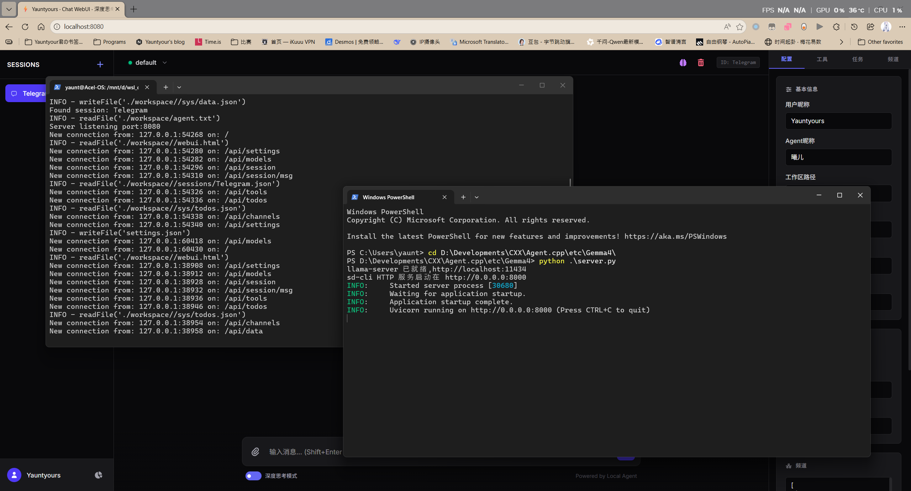

# agent.cpp：极致轻量、完全可控的 C++ Agent 系统（WebUI）

## 简介

**agent.cpp** 是一个完全透明、高度可控的 C++ 原生 Agent 系统，具备完整的工具链支持。与庞大的 Openclaw 等框架相比，agent.cpp 仅依赖少数几个核心文件实现通信调度与工具管理，内存占用极低（系统额外开销趋近于零，实际占用完全取决于上下文长度），尤其适合资源受限或边缘计算环境。

**设计理念**：语言是经验的载体。LLM 作为系统的语言中枢服务于 Agent，Agent 再将语言转化为行动与记忆。二者的协同，是通向通用人工智能（AGI）的一条可行路径。

## WebUI



## 核心特性

- **极致轻量**：核心系统仅由数个 `.cpp`/`.hpp` 文件构成，充分利用 C++ 零拷贝与栈上分配特性，运行开销极低。
- **完整工具链**：通过 Python CLI 桥接方式，支持任意 Python 工具的原生链式调用。
- **100% 可控**：系统提示词（System Prompt）完全开放自定义，无隐藏魔法指令。
- **轻量化扩展设计**：工具直接调用 Python CLI 脚本，避免加载臃肿的技能包描述，最大限度节省上下文 Token。
- **会话记忆系统**：支持自动/手动将对话历史摘要为记忆，并实时更新会话上下文。
- **会话记录热加载**：切换会话或频道时，记忆与聊天记录无缝动态加载。
- **记忆自动演进**：当会话已存在记忆时，系统会基于既有记忆与最新交互自动优化并更新记忆内容，实现经验积累的闭环。

## 核心文件结构

为了便于理解与二次开发，以下列出系统核心文件及其职责：

```
.
├── agent.cpp / agent.hpp      # Agent 主循环、状态管理与指令分发
├── app.cpp                    # 程序入口，初始化服务与配置
├── servic.cpp                 # WebUI 后端服务与 API 处理
├── ui.py                       # WebUI 界面脚本（Python）
├── webui.html                 # WebUI 前端页面
├── sys/                       # 系统指令、工具调度与通信核心
├── tools/                     # 自定义 Python 工具存放目录
├── sessions/                  # 会话记录与记忆持久化
└── settings.json              # 系统配置文件
```

> 注：实际文件数量可能随版本迭代微调，以上为核心逻辑分布。

## 系统指令集

系统采用简洁的 XML 标签格式进行内部通信，确保行为可审计、可干预。

### 1. 工具调用指令（Tools Call System）

调用预定义工具，格式：

```
<tool>name:args</tool>
```

**内置基础工具**：

| 工具调用格式 | 功能描述 |
| :--- | :--- |
| `exec:<command>` | 以当前服务权限执行系统命令 |
| `read:<filepath>` | 读取指定文件内容 |
| `write:<filepath>\|<data>` | 向指定文件写入数据（覆盖） |
| `wget:<URL>` | 发起 HTTP GET 请求并返回响应 |

**示例**：

```xml
<tool>exec:pip list</tool>
<tool>Image:test.jpg</tool>
<tool>write:exp/data.txt|Hello, agent!</tool>
<tool>read:data.txt</tool>
<tool>wget:https://cn.bing.com/</tool>
```

### 2. 通信系统指令（Communication System, CS）

用于获取系统状态或执行控制命令，格式：

```
<cs>name:args</cs>
```

**支持的命令**：

| 命令 | 功能描述 |
| :--- | :--- |
| `system_status` | 返回当前系统运行状态摘要 |
| `tools_status` | 返回所有已注册工具的状态 |
| `restart` | 请求重启系统（需 master 显式确认） |
| `time` | 返回当前系统日期与时间 |
| `random:<seed>` | 基于种子生成 [-1e9, 1e9] 范围内的伪随机数 |

**示例**：

```xml
<cs>time</cs>
<cs>random:123</cs>
```

## 自定义 Tool 开发

自定义工具采用约定优于配置的方式，仅需提供两个文件即可被系统识别和调度。以 `playwright-tools` 为例，目录结构如下：

```
/workspace/tools/
└── playwright-tools
    ├── run.py       # 被 CS 指令系统调度的入口脚本
    ├── tool.md      # 工具的参数文档、使用说明（仅此文件被系统读取用于生成帮助）
    └── ...          # 其他依赖文件（系统仅调用 run.py）
```

**建议在 `run.py` 中实现帮助信息回退**：当参数错误或调用失败时，将 `tool.md` 的内容打印到标准输出，以便 Agent 获取正确的调用方式。

```python
import os

def print_tool_help():
    """打印 tool.md 中的帮助信息"""
    script_dir = os.path.dirname(os.path.abspath(__file__))
    tool_md_path = os.path.join(script_dir, "tool.md")
    try:
        with open(tool_md_path, "r", encoding="utf-8") as f:
            print(f.read())
    except FileNotFoundError:
        print(f"警告: 未找到帮助文件 {tool_md_path}")
```

## 安全与控制机制

- **高风险操作需显式授权**：当 Agent 处于自主调用模式时，执行重启、关键文件写入等操作必须获得用户显式确认。通过主动指令触发的操作则无需二次确认（仍建议通过提示词约束 `shutdown` 等敏感行为）。
- **工具状态实时反馈**：每次工具调用后，系统会以独立消息形式返回执行结果（成功或错误详情）。
- **开箱即用**：会话启动后即可使用全部工具，亦可随时通过 `<cs>tools_status</cs>` 查询可用工具列表。

## 会话管理

- **WebUI 会话**：以创建时的 UNIX 时间戳（秒）作为唯一 `Session ID`，同时用作会话目录命名。
- **频道（Channel）**：每个频道对应一个以频道名命名的 JSON 文件，存储该频道的聊天记录。频道与 WebUI 会话一样具备独立的记忆摘要。

### 自动会话记忆

当会话上下文长度超过配置的阈值时，系统会自动触发记忆摘要生成（或更新），并将记忆注入当前上下文。阈值可通过配置文件调整：

```json
"max_context": 128000
```

> 注：阈值为字符数估算值，实际触发逻辑由系统内部维护。

## 系统提示词自定义（System Prompt）

系统支持 **100% 自定义** 系统提示词。您可以在 `agent.txt`（或配置中指定的路径）中以纯文本形式定义 Agent 的行为准则与身份认知。提示词结构建议包含以下模块：

- **外部宣言（External Manifesto）**：优先级排序的行为总则。
- **身份认知初始化**：定义“你是谁”的起点。
- **行为许可与禁止**：
    - 允许的行为（Permitted Conduct）
    - 禁止的行为（Prohibited Acts）
- **服务对象定义**：明确 Agent 为谁服务及其关系。
- **自我愿景**：Agent 期望达成的长期目标或角色定位。
- **边界定义**：能力与权限的硬性边界。
- **工具调用说明**：必须保留的章节，用于告知 Agent 可用的 CS 指令及其格式。

> 除“工具调用说明”部分需保留必要技术信息外，其余内容均可自由增删修改。

## 配置文件详解

```json
{
    "name": "user",                      // 用户名称
    "agent_nickname": "AI",              // Agent 在会话中的显示昵称
    "workspace": ".",                    // 工作根目录，需包含 sessions、memorys、sys、tools 等子目录
    "server_address": "http://localhost:11434", // LLM 服务地址（兼容 OpenAI API 格式）
    "model": "name",                     // 模型名称
    "prompt_path": "agent.txt",          // 系统提示词文件路径（相对于 workspace）
    "stream": false,                     // 是否启用流式响应（使用 llama.cpp 时建议关闭，防止 JSON 解析异常）
    "max_mpc_rounds": 10,                // 最大多轮工具调用轮次
    "max_context": 128000,               // 触发自动记忆摘要的上下文长度阈值
    "channels": [
        {
            "name": "Telegram",
            "status": "active",
            "user_count": 1,
            "path": "sys/tg_bot.py"      // 频道对应的驱动脚本
        }
    ]
}
```

## 授权与致谢

本项目遵循 [Apache-2.0](LICENSE) 协议。在使用或分发时，请保留原始版权与许可声明。若您认可本项目的价值，欢迎点亮 Star ⭐，这对我是极大的鼓励。

---