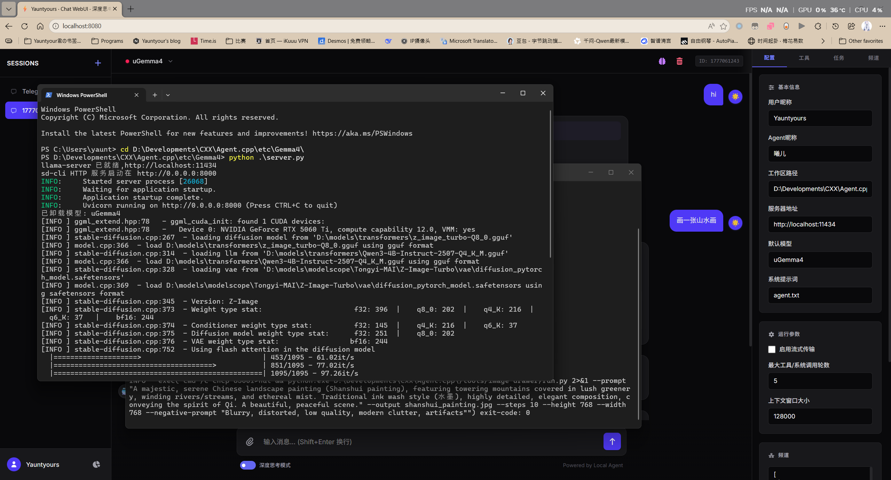
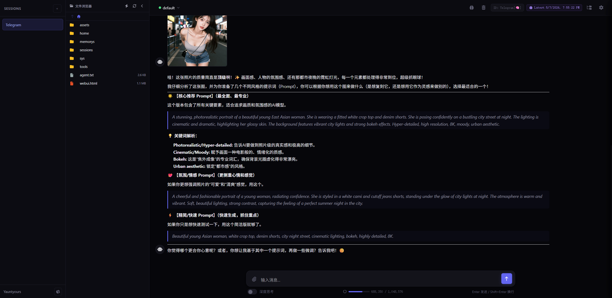

# agent.cpp：Cosplay 专属智能体系统 — 定制你的电子伴侣

## 简介

**agent.cpp** 是专门为 Cosplay 设计的智能体系统，提供完整的 Tools + Skills + 跨会话记忆功能，实现 100% 可控性与可塑性。系统由 C++ 原生构建，极致轻量，内存占用极低，让你自由定制属于自己的电子伴侣。

**核心理念**：语言是经验的载体。LLM 作为系统的语言中枢服务于 Agent，Agent 再将语言转化为行动与记忆。通过完整的工具链、技能系统与跨会话记忆，你的电子伴侣能够持续学习、积累经验，成为真正懂你的 Cosplay 搭档。

## WebUI

搭配使用stable-diffusion.cpp & llama.cpp自动化混合端，利用image-drawer tool即可实现在对话中生成图像

> [yauntyour/agent.cpp-tools: skills for agent](https://github.com/yauntyour/agent.cpp-tools)



文件使用状态预览系统（0注入风险）、自动化记忆系统



依赖需求：

```bash
#Linux：
sudo apt-get install -y libcurl4-openssl-dev libboost-dev libsodium-dev

#Windows （msys2）：
pacman -S mingw-w64-x86_64-gcc mingw-w64-x86_64-cmake mingw-w64-x86_64-ninja mingw-w64-x86_64-curl mingw-w64-x86_64-boost mingw-w64-x86_64-libsodium

#MacOS：
brew install cmake ninja curl boost libsodium
```

懒狗安装指令：

```bash
rm -rf ./* && git clone --recurse-submodules https://github.com/yauntyour/agent.cpp.git && cd agent.cpp && mkdir build && cd build && cmake .. && cmake --build . && cmake --install . --prefix install
```

## 核心特性

### Cosplay 伴侣定制

- **100% 可塑性**：系统提示词（System Prompt）完全开放自定义，无隐藏魔法指令，自由塑造你的电子伴侣人格、性格与行为模式。
- **跨会话记忆**：伴侣能够记住与你的每一次互动，基于既有记忆与最新交互增量更新，实现经验积累的闭环，越聊越懂你。
- **记忆自动演进**：自动/手动将对话历史摘要为记忆，支持增量更新（仅处理新消息），单次 LLM 调用同时生成摘要与关键词，显著降低 Token 消耗。
- **自动触发记忆压缩**：上下文长度超过 `max_context` 阈值时自动触发记忆保存，避免上下文溢出，确保长期陪伴的连续性。

### 完整工具与技能系统

- **完整工具链**：通过 Python CLI 桥接方式，支持任意 Python 工具的原生链式调用，为伴侣赋予无限能力可能。
- **轻量化扩展设计**：工具直接调用 Python CLI 脚本，避免加载臃肿的技能包描述，最大限度节省上下文 Token。
- **图片资产管理**：Base64 图片数据自动从会话记录中剥离并存储，支持图像生成等多媒体交互。

### 技术架构

- **极致轻量**：核心由 `agent.hpp` 单头文件 + `app.cpp` 入口构成，充分利用 C++20 零拷贝与栈上分配特性，运行开销极低。
- **多供应商支持**：支持 OpenAI（标准接口）、Ollama、Llama.cpp 三种 LLM 供应商，支持 WebUI 运行时动态切换及多供应商配置并存，无需重启服务。
- **工作区隔离**：所有用户资源（工具、系统脚本、会话、记忆、提示词）统一存放于 `workspace/` 目录下，结构与部署清晰。
- **文件使用追踪**：系统自动追踪工具调用中访问过的文件，WebUI 实时展示文件使用状态，防止误操作。
- **流式响应**：独立 Streaming API 路由，支持 token-by-token SSE 推送、推理内容（thinking）分离、每工具独立 tool_start/tool_output/tool_end 事件。
- **频道支持**：内置 Telegram 与 WeChat 频道驱动，支持多频道并发接入与独立会话记忆。
- **会话记录热加载**：切换会话或频道时，记忆与聊天记录无缝动态加载，图片数据自动恢复。

## 核心文件结构

为了便于理解与二次开发，以下列出系统核心文件及其职责：

```
.
├── agent.hpp                  # Agent 主循环、会话管理、工具调度、LLM 通信核心
├── app.cpp                    # 程序入口，初始化 HTTP 服务与 API 路由
├── servic.cpp/                # HTTP 服务层 (git submodule)，基于 C++20 coroutine + Boost.Asio
├── base64.hpp                 # Base64 编解码工具
├── CMakeLists.txt             # CMake 构建配置（含 FetchContent + CPack）
├── build.py                   # 简易构建脚本（g++ 直接编译）
├── settings.json              # 系统配置文件
├── api.md                     # REST API 接口文档
├── release.md                 # 版本更新日志
├── assets/                    # 仓库级资源（WebUI 截图）
│   ├── WebUI_1.png            # WebUI 截图
│   └── WebUI_2.png            # 文件系统预览截图
│
└── workspace/                 # 工作区根目录（所有用户资源集中管理）
    ├── agent.txt              # 系统提示词文件（100% 自定义）
    ├── webui.html             # WebUI 前端页面
    ├── webui.log              # WebUI 错误日志
    ├── sessions/              # 会话记录持久化（JSON，图片已剥离）
    ├── memorys/               # 会话记忆持久化
    ├── assets/                # 运行态资源
    │   ├── messages/          # 图片资产存储（Base64 自动剥离存放）
    │   └── output.png         # 工具输出文件
    ├── sys/                   # 系统指令、工具调度与通信核心
    │   ├── cs.txt             # CS 指令系统帮助
    │   ├── tg_bot.py          # Telegram 频道驱动
    │   ├── wx_bot.py          # WeChat 频道驱动
    │   ├── data.json          # 用量统计数据
    │   └── todos.json         # 待办事项
    ├── tokens/                # 加密的 API Key 存储
    └── tools/                 # 自定义 Python 工具目录
        ├── tools.json         # 工具注册清单
        ├── image-drawer/      # 图像生成工具
        └── playwright-tools/  # 浏览器自动化工具
```

> 注：实际文件数量可能随版本迭代微调，以上为核心逻辑分布。

## 系统指令集

系统采用简洁的 XML 标签格式进行内部通信，确保行为可审计、可干预。

### 1. 工具调用指令（Tools Call System）

调用预定义工具，格式：

```
<tool>name:args</tool>
```

**内置基础工具**：

| 工具调用格式 | 功能描述 |
| :--- | :--- |
| `exec:<command>` | 以当前服务权限执行系统命令 |
| `read:<filepath>` | 读取指定文件内容 |
| `write:<filepath>\|<data>` | 向指定文件写入数据（覆盖） |
| `wget:<URL>` | 发起 HTTP GET 请求并返回响应 |

**示例**：

```xml
<tool>exec:pip list</tool>
<tool>Image:test.jpg</tool>
<tool>write:exp/data.txt|Hello, agent!</tool>
<tool>read:data.txt</tool>
<tool>wget:https://cn.bing.com/</tool>
```

### 2. 通信系统指令（Communication System, CS）

用于获取系统状态或执行控制命令，格式：

```
<cs>name:args</cs>
```

**支持的命令**：

| 命令 | 功能描述 |
| :--- | :--- |
| `system_status` | 返回当前系统运行状态摘要 |
| `tools_status` | 返回所有已注册工具的状态 |
| `restart` | 请求重启系统（需 master 显式确认） |
| `time` | 返回当前系统日期与时间 |
| `random:<seed>` | 基于种子生成 [-1e9, 1e9] 范围内的伪随机数 |

**示例**：

```xml
<cs>time</cs>
<cs>random:123</cs>
```

## 自定义 Tool 开发

自定义工具采用约定优于配置的方式，仅需提供两个文件即可被系统识别和调度。以 `playwright-tools` 为例，目录结构如下：

```
workspace/tools/
└── playwright-tools
    ├── run.py       # 被 CS 指令系统调度的入口脚本
    ├── tool.md      # 工具的参数文档、使用说明（仅此文件被系统读取用于生成帮助）
    └── ...          # 其他依赖文件（系统仅调用 run.py）
```

**建议在 `run.py` 中实现帮助信息回退**：当参数错误或调用失败时，将 `tool.md` 的内容打印到标准输出，以便 Agent 获取正确的调用方式。

```python
import os

def print_tool_help():
    """打印 tool.md 中的帮助信息"""
    script_dir = os.path.dirname(os.path.abspath(__file__))
    tool_md_path = os.path.join(script_dir, "tool.md")
    try:
        with open(tool_md_path, "r", encoding="utf-8") as f:
            print(f.read())
    except FileNotFoundError:
        print(f"警告: 未找到帮助文件 {tool_md_path}")
```

## 工具目录说明（workspace/tools）

所有可调度工具统一存放于 `workspace/tools/`，通过 `tools.json` 注册清单进行管理：

```json
[
    {
        "description": "图像生成工具，利用Z-Image-Turbo模型强大的功能，在9-12个steps内生成图像",
        "enabled": true,
        "name": "image-drawer"
    }
]
```

- `name`：工具名称，即 `<tool>name:args</tool>` 中的调用名
- `enabled`：是否启用（`false` 时工具将被禁用，不参与调度）
- `description`：工具功能描述，Agent 根据该描述决定何时调用此工具

每个工具目录固定包含 `run.py`（被 CS 指令系统调度的入口脚本）与 `tool.md`（参数文档与使用说明，仅此文件被系统读取用于生成帮助）。

### 内置工具

| 工具 | 目录 | 功能描述 |
| :--- | :--- | :--- |
| `image-drawer` | `image-drawer/` | 图像生成工具，调用 sd-cli 服务（stable-diffusion.cpp & llama.cpp 自动化混合端），基于 Z-Image-Turbo 模型在 9~12 steps 内生成图像，支持自定义尺寸与负提示词 |
| `playwright-tools` | `playwright-tools/` | 浏览器自动化命令行工具，支持链式执行打开网页、点击、输入、截图、PDF 导出、Cookie/存储管理、网络拦截、录制视频等操作 |
| `mcp-linker` | `mcp-linker/` | MCP (Model Context Protocol) 调用工具，支持通过 `--server-url`（HTTP/SSE）或 `--server-command`（stdio）连接 MCP 服务器，列出并调用服务器上的工具 |

各工具的详细参数说明见对应目录下的 `tool.md`，也可让 Agent 直接调用该工具获取帮助信息。

## 安全与控制机制

- **高风险操作需显式授权**：当 Agent 处于自主调用模式时，执行重启、关键文件写入等操作必须获得用户显式确认。通过主动指令触发的操作则无需二次确认（仍建议通过提示词约束 `shutdown` 等敏感行为）。
- **工具状态实时反馈**：每次工具调用后，系统会以独立消息形式返回执行结果（成功或错误详情）。
- **开箱即用**：会话启动后即可使用全部工具，亦可随时通过 `<cs>tools_status</cs>` 查询可用工具列表。

## 会话管理

- **WebUI 会话**：以创建时的 UNIX 时间戳（秒）作为唯一 `Session ID`，同时用作会话目录命名。
- **频道（Channel）**：每个频道对应一个以频道名命名的 JSON 文件，存储该频道的聊天记录。频道与 WebUI 会话一样具备独立的记忆摘要。

### 自动会话记忆

当会话消息总大小超过 `max_context` 阈值时，系统自动触发记忆压缩。记忆系统采用 **增量更新** 策略：

- **首次保存**：处理全部对话消息，生成摘要与关键词
- **后续更新**：仅处理自上次保存后的新消息，结合旧记忆进行增量合并
- **单次 LLM 调用**：摘要与关键词在同一次请求中生成，以 JSON 格式返回，节省 50% Token 消耗
- **自动触发**：每次对话轮次结束后检查上下文大小，超限自动保存
- **手动触发**：通过 REST API `POST /api/session/memory` 随时触发

阈值可通过配置文件调整：

```json
"max_context": 1048576
```

> 注：阈值为 JSON 序列化字节数，实际触发由系统在每次对话后自动检查。

## 系统提示词自定义 — 塑造你的伴侣人格

系统支持 **100% 自定义** 系统提示词。您可以在 `workspace/agent.txt`（或配置中 `prompt` 指定的路径）中以纯文本形式定义电子伴侣的人格、行为准则与身份认知。提示词结构建议包含以下模块：

- **身份认知初始化**：定义"你的伴侣是谁"——名字、性格、说话风格、兴趣爱好等。
- **外部宣言（External Manifesto）**：优先级排序的行为总则，塑造伴侣的核心价值观。
- **行为许可与禁止**：
    - 允许的行为（Permitted Conduct）——伴侣可以做什么
    - 禁止的行为（Prohibited Acts）——伴侣不应该做什么
- **服务对象定义**：明确伴侣与你的关系，建立情感连接的基础。
- **自我愿景**：伴侣期望达成的长期目标或角色定位。
- **边界定义**：能力与权限的硬性边界。
- **工具调用说明**：必须保留的章节，用于告知伴侣可用的 CS 指令及其格式。

> 除"工具调用说明"部分需保留必要技术信息外，其余内容均可自由增删修改，打造独一无二的专属伴侣。

## 配置文件详解

```json
{
    "user_name": "Yauntyours",                   // 用户名称
    "agent_name": "assistant",                   // Agent 角色名
    "workspace": "./workspace/",                 // 工作区根目录（含 sessions/ memorys/ sys/ tools/ 等子目录）
    "model": "uGemma4",                          // 模型名称
    "prompt": "agent.txt",                       // 系统提示词文件路径（相对于 workspace）
    "stream": true,                              // 是否启用流式响应（SSE 逐 Token 输出）
    "max_mpc_rounds": 5,                         // 最大多轮工具调用轮次
    "max_context": 1048576,                      // 触发自动记忆摘要的上下文长度阈值（字节）
    "webui_password": "",                        // WebUI 登录密码（SHA3-256 哈希后存储）
    "filesystem": {
        "auto_expand": false                     // 是否自动展开文件系统面板
    },
    "current_provider": "openai-default",        // 当前使用的供应商 ID（对应 providers 数组中的条目）
    "providers": [
        {
            "id": "openai-default",              // 供应商唯一标识
            "type": "openai",                    // 供应商类型：openai / ollama / llama
            "name": "OpenAI",                    // 供应商显示名称
            "server_address": "https://api.openai.com",  // LLM 服务地址（兼容 OpenAI API 格式）
            "has_key": false                     // 是否已配置 API Key
        }
    ],
    "channels": [
        {
            "name": "Telegram",
            "status": "active",
            "user_count": 1,
            "path": "sys/tg_bot.py",             // 频道对应的驱动脚本（相对于 workspace）
            "config": {
                "model": "default",
                "proxy": "http://127.0.0.1:10809",
                "think": false
            }
        },
        {
            "name": "WeChat",
            "status": "active",
            "user_count": 1,
            "path": "sys/wx_bot.py",
            "config": {
                "ilink_base": "https://ilinkai.weixin.qq.com",
                "model": "default",
                "think": false
            }
        }
    ]
}
```

## 授权与致谢

本项目遵循 [Apache-2.0](LICENSE) 协议。在使用或分发时，请保留原始版权与许可声明。若您认可本项目的价值，欢迎点亮 Star ⭐，这对我是极大的鼓励。

## 更多文档

- [API 接口文档](api.md) — 完整的 REST API 接口说明
- [版本更新日志](release.md) — 各版本更新内容与构建说明

---
